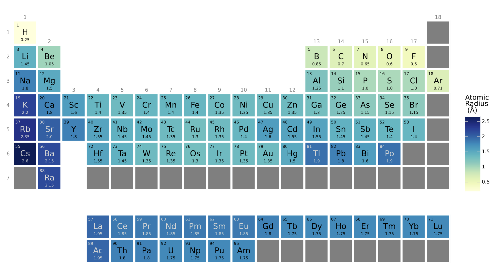

# Periodic Table Heatmap

This repo provides a Python class that uses [`plotnine`](https://plotnine.readthedocs.io/en/stable/) to plot a heatmap of the periodic table. 

The values can represent any continuous element property (e.g. atomic radius, electronegativity)

The result is something like the plot below:



## Installation

To install the necessary dependencies for this project, run the following command:

```bash
pip install -r requirements.txt
```

## Usage

```python
from periodic_table_heatmap import PeriodicTableHeatMap
import pandas as pd

# Create a dataframe 'df' with necessary columns (In this example: 'elements' and 'atomic_radius')

heatmap = PeriodicTableHeatMap(df)
heatmap.plot('atomic_radius') # Input the column that has the continuous values for the elements
heatmap.save_fig('heatmap.pdf') # Save the plot as pdf
```

In this code, `df` is a pandas DataFrame containing a column for the elements (`element`) and columns for the properties. The `PeriodicTableHeatMap` class is used to generate and save the heatmap.

The notebook `demo.ipynb` demonstrates how to use the class `PeriodicTableHeatMap` defined at `pthm/core.py` to plot the heatmap.

## License

This project is licensed under the MIT License.
